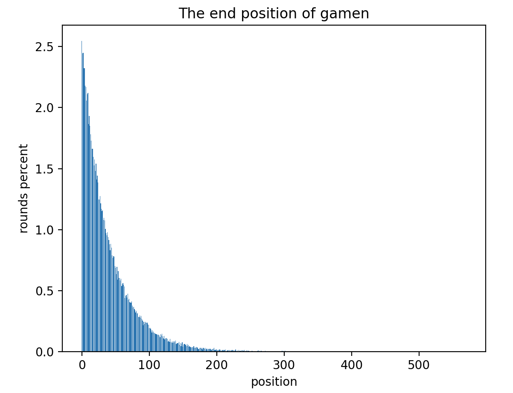

# "Guess 2/3 of the Mean" dApp Game Design

[2/3 of guessed average value](https://zh.m.wikipedia.org/zh-cn/%E7%8C%9C%E5%9D%87%E5%80%BC%E7%9A%842/ 3) It is a classic game, and now it is transformed into a dApp game running on the blockchain. These are the basic rules of the game:

1. Players pay `any amount` to play
2. Calculate the `sum of amounts` paid by all users
3. Calculate 2/3 of the average value of `Sum of Money` as `Winning Number`
4. The player who pays `Any Amount` closest to the `Winning Number` wins

The reward rules of the game are:

5. If multiple users pay the same `any amount`, the first user to participate wins
6. The winner gets the `summary amount` paid by all users in this round of the game
7. The contract draws 1% of the `total amount` in each round of the game as a service fee

An important question is, how many players are involved in each game round? Or when does each round of the game end? The rules about the end of the game are as follows:

8. In each round of the game, when the player participates, it can be known that the player is the `n`th participant
9. Generate a random number `x` (10<=x<=100)
10. According to `n` and `x`, generate a random number boundary `l, r = n-x, n+x`
11. Generate a random number `y` in the interval `[l, r]`
12. If `y == n`, the round ends

Above are all the rules of this game.

The rules for ending the game are a bit complicated. Take a specific value. For example, there is a player who is `n=50`th to participate in the game, and then generates a random number `x=10`, then the boundary of the generated random number is `l, r = 45, 55`. Generate another random number in the range [45, 55], if it is exactly 50, the round ends.

Why do you want to do this? Because the data on the blockchain is public. In the original "guess 2/3 of the mean" game, the numbers chosen by the players are kept secret from each other. But it's hard to do that on the blockchain. Therefore, the game rules of the dApp version proposed here are different from the original rules in at least two points:

- The amount paid by players to participate in the game is unlimited, it can be 0, or it can be infinite, while the original rules have an upper limit
- The number of players is uncertain, the original rule is to know how many players will participate

This difference is designed because the data on the blockchain is public, so some random mechanisms need to be introduced. If there is no random ending mechanism, when the number of players is determined, the later players will have an advantage, because you can calculate which number you use to participate is more likely to win based on the records of the previous players.

Of course, the last player to participate may not necessarily be able to turn the tide, especially if the participation value is capped. But if the number of players is random, there is no such thing as "the next player", because no one knows when the game ends and who is the last player. So even if the player can pay the amount to reverse the situation, he will be pulled down by the players behind.

As for the original game, the participation value is required to be an integer, while the participation value of the dApp version can be unlimited and can be a decimal. It is because the original game is artificially given the participation value, but the dApp version can be freely input on the computer, and the result is calculated by the smart contract, without limiting the accuracy and having no impact.

Then explain the rules for the end of the game. The effect of this rule is to make the game end in the interval [10, 100] of participants in most cases. This interval corresponds to the range of `x` in `Rule 9`.

This rule can be understood as follows: each user has the ability to end the game, but the ability is random, the highest is 1/10, and the lowest is 1/100. If you have a 1/10 ability, you have a 1/10 chance that the game will end.

Assuming that all users have the highest ability 1/10, then the game will most likely end after 10 people participate. The probability of each person triggering the "game over" event is independent, no matter how many people participate, it is 1/10. The more people involved, the more likely it is to end, since the probability of not ending is 9/10 to the power of the number of people.

Assuming that all users have the lowest ability 1/100, then the game will most likely end after 100 people participate.

So the range of `x` in `Rule 9` presumably limits the range of the number of participants. Of course, the number range [10, 100] here is not a strict probability calculation.

According to the game ending rules defined above, the results of 100,000 runs are simulated here, and the game will end when "how many players participate". The code is here: [guessavg/emulate_tool](https://github. com/guessavg/emulate_tool)

The abscissa of this graph is the number of players participating in the game, and the ordinate is the number of times the game ends in the corresponding number. For example, at a position close to 1, there are 2,500 times, which means that in 100,000 games, 2,500 times 1 player participates and it ends.

If the number of times is not intuitive enough, you can look at the graph of this ratio. The ratio of the end of each number does not exceed 2.5%. The closer the position is, the more likely the game will end, because every time it starts from 0, the earlier position has a little more chance of ending the game.

This proportional graph is more illustrative of the results. The game has close to 20% probability of ending when the number of participants is less than 10, and close to 70% probability of ending within the range of [10, 100] participants. The probability of the game ending when the number of participants is greater than 300 is only 0.07%.

Although the result of this rule is not a complete normal distribution in probability, it can basically meet the initial requirements, that is, let the game end at a random time point, and the end time will not be too outrageous, and will not lead to participation The number of people is too small or too many, and it also provides a certain small probability, allowing the number of participants to reach about 500.

I believe this will be a reasonable design.
